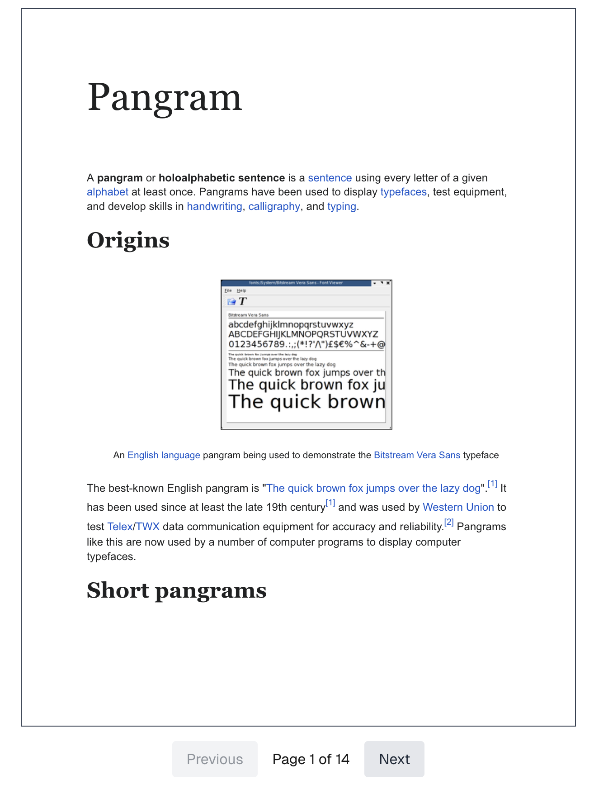
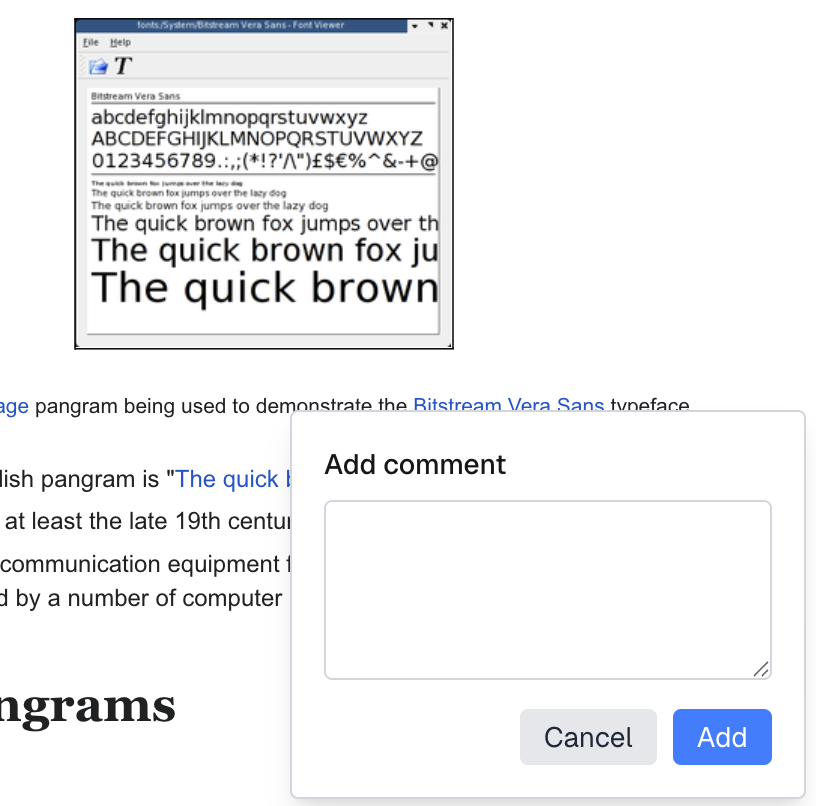
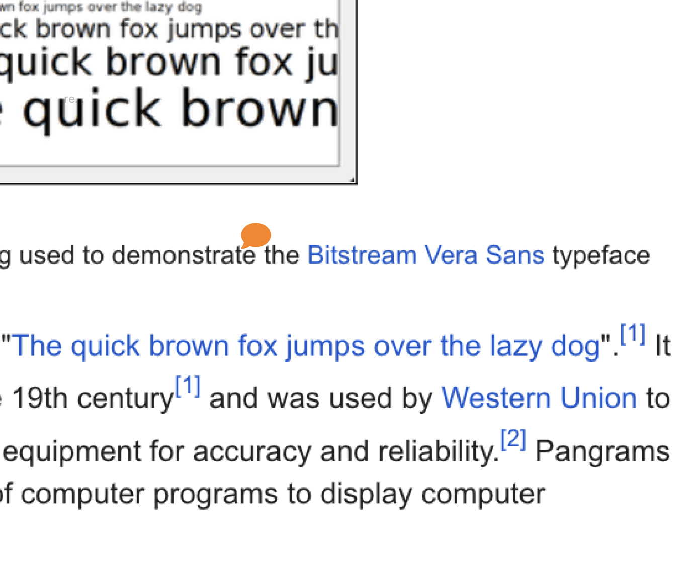

# Pangram Labs Practical Interview

Welcome to the Pangram Labs practical interview assessment.

## Project Requirements

### Step 1: PDF Loading

- Implement functionality to load and display `pangram.pdf` in the web application. (react-pdf)

### Step 2: PDF Pagination

- Add navigation controls to browse through multiple pages:
  - Previous page button
  - Current page number indicator
  - Total page count display
  - Next page button

  

### Step 3: PDF Annotation - Adding Comments

- Implement a feature where clicking anywhere on the PDF opens a comment input box
- Users should be able to enter and submit comments
- The comment box should automatically close when navigating to a different page

  

### Step 4: PDF Annotation - Displaying Comments
- Display submitted comments directly on the PDF as comment icons (react-icons)
- Position each comment icon at the exact location where the user initially clicked
- Comments should persist while viewing the same page

  
